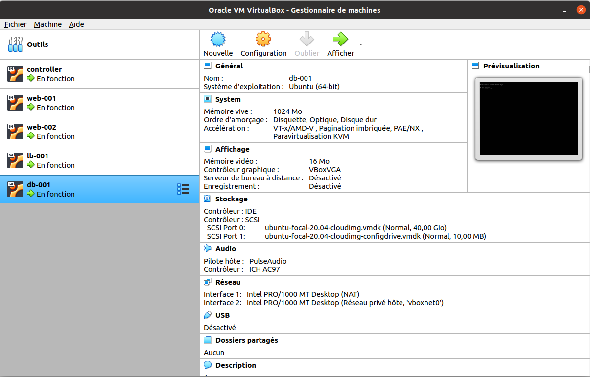
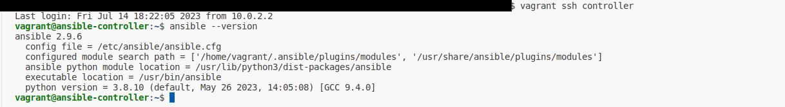
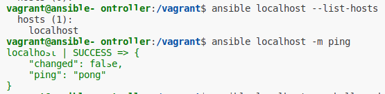
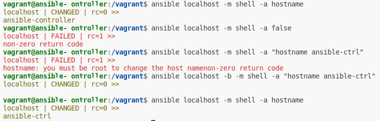

# Apress Source Code

This repository accompanies [*Beginning Ansible Concepts and Application: Provisioning, Configuring, and Managing Servers, Applications and their Dependencies*](https://www.link.springer.com/book/10.1007/9781484281727) by Shaun R Smith and Peter Membrey (Apress, 2022).

[comment]: #cover


Download the files as a zip using the green button, or clone the repository to your machine using Git.

## Chapter 1: Getting Setup and Running

Setup virtual box machines using vagrant:

```shell
$ cd wherever/Beginning-Ansible-Concepts-And-Application
$ vagrant up
```

Use virtual box panel to display virtual box:



Se connecter au controller:
```shell
$ vagrant ssh controller
$ ansible --version
```

Display ansible version:


## Chapter 2: Your first steps with Ansible

List all hosts known by Ansible:

```shell
$ ansible all --list-hosts
```

List all hosts known by Ansible locally:

```shell
$ ansible localhost --list-hosts
```

Run the ping module against the localhost 
to check if the localhost is a state suitable to  be managed by Ansible:

```shell
$ ansible localhost -m ping
```



Run the shell module with the localhost command as argument:

```shell
$ ansible localhost -m shell -a hostname
```
Remark:
rc=0 stands for "return code is 0"

Run the false module:

```shell
$ ansible localhost -m false
```

Change the controller hostname becoming admin with -b flag:

```shell
# change hostname becoming admin
$ ansible localhost -b \
  -m shell -a hostname "ansible-ctrl"

# check the new hostname
$ ansible localhost -m shell -a hostname  
```

