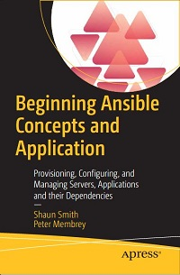
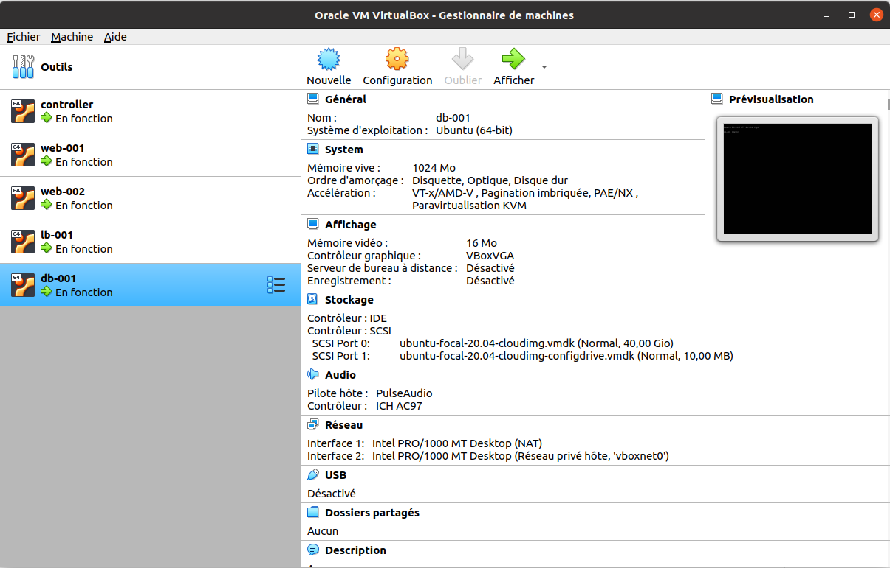

# Apress Source Code

This repository accompanies [*Beginning Ansible Concepts and Application: Provisioning, Configuring, and Managing Servers, Applications and their Dependencies*](https://www.link.springer.com/book/10.1007/9781484281727) by Shaun R Smith and Peter Membrey (Apress, 2022).

[comment]: #cover


Download the files as a zip using the green button, or clone the repository to your machine using Git.

## Chapter 1: Getting Setup and Running

Setup virtual box machines using vagrant:

```shell
$ cd wherever/Beginning-Ansible-Concepts-And-Application
$ vagrant up
```

Use virtual box panel to display virtual box:



Se connecter au controller:
```shell
$ vagrant ssh controller
$ ansible --version
```

Display ansible version:
[ansible version](images/03-ansible-version.png)

## Chapter 2: Your First Steps with Ansible

### 1. List avaialble hosts

List all hosts known by Ansible:

```shell
$ ansible all --list-hosts
```

List all hosts known by Ansible locally:

```shell
$ ansible localhost --list-hosts
```

Run the ping module against the localhost 
to check if the localhost is a state suitable to  be managed by Ansible:

### 2. Check if a commande is executable upon a host

```shell
$ ansible localhost -m ping
```
See:  
[Ansible Ping Module](images/04-ansible-ping.png)

Run the shell module with the localhost command as argument:

### 3. Use shell module

```shell
$ ansible localhost -m shell -a hostname
```

Remark:
rc=0 stands for "return code is 0"

Run the false module:

```shell
$ ansible localhost -m false
```
Change the controller hostname becoming admin with -b flag:

```shell
# change hostname becoming admin
$ ansible localhost -b \
  -m shell -a hostname "ansible-ctrl"

# check the new hostname
$ ansible localhost -m shell -a hostname  
```
See:  
[Ansible Shell Module](images/05-ansible-shell.png)

Change the hostname using the hostname module shows **Ansible Facts**:

### 4. Use hostname module

Display hostname module documentation:

```shell
$ ansible-doc hostname
```

Change hostname using hostname module:

```shell
$ ansible localhost -b -m hostname -a ansible-controller
```

See:  
[Ansible Hostname Module](images/06-ansible-hostname.png)

### 5. Use a **hosts** inventory and an **ansible.cfg** file

Add a **hosts** file with the targeted hosts:

```
web-001.local
web-002.local
```

Add an **ansible.cfg** file:

```
[defaults]

# Avoid ssh check
host_key_checking = false

# Setup the inventory file name
inventory = hosts
```
Ping the default nodes:

```shell
$ cd /vagrant/chapter02
$ ansible all -m ping

# equals to
$ ansible -i hosts all -m ping
```

See:  
[Ansible Inventory](images/07-ansible-inventory.png)

## Chapter 3: Choosing Your Targets

### 1. Setup ip and port of an host part of an inventory

Display host's ip:

```shell
$ cd /vagrant/chapter02
$ ansible all -m shell -a "hostname -I"
```

Setup ip and port of an inventory's host:

```shell
web-002 ansible_host=192.168.98.112 ansible_port=22
 ```

 Ansible built-in variable:

 variable | meaning
 ---  | ---
 ansible_host | the hostname or ip address to connect to
 ansible_port | the ssh port to use when connecting to the host
 ansible_user | the username to use when connecting to the host
 ansible_become | become an admin before executing a command

 Execute a sanity check against a inventory's group:

 ```shell
$ cd /vagrant/chapter02
$ ansible webservers --list-hosts
```