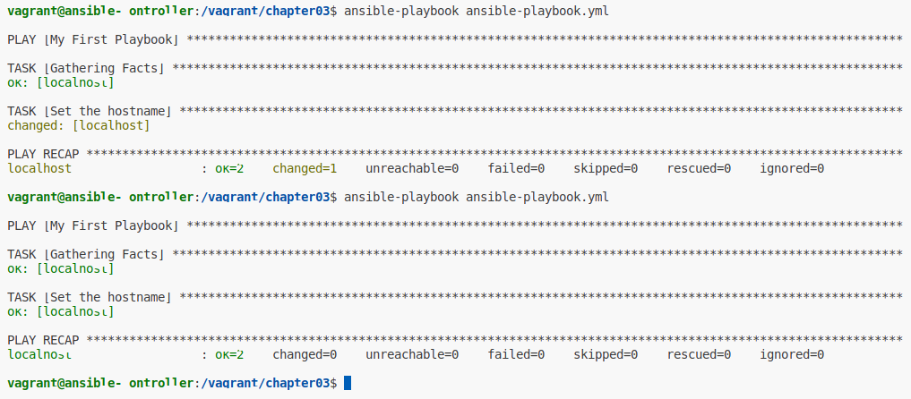
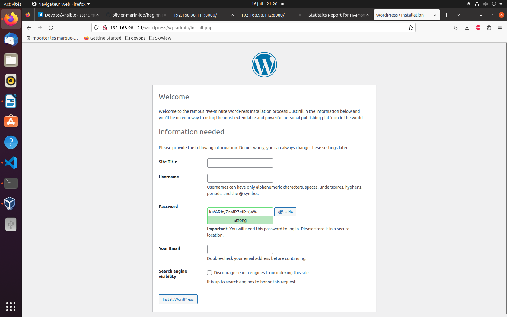

# Apress Source Code

This repository accompanies [*Beginning Ansible Concepts and Application: Provisioning, Configuring, and Managing Servers, Applications and their Dependencies*](https://www.link.springer.com/book/10.1007/9781484281727) by Shaun R Smith and Peter Membrey (Apress, 2022).

[comment]: #cover


Download the files as a zip using the green button, or clone the repository to your machine using Git.

## Chapter 1: Getting Setup and Running

Setup virtual box machines using vagrant:
```shell
$ cd wherever/Beginning-Ansible-Concepts-And-Application
$ vagrant up
```

Use virtual box panel to display virtual box:


Se connecter au controller:
```shell
$ vagrant ssh controller
$ ansible --version
```

Display ansible version:
[ansible version](images/03-ansible-version.png)

## Chapter 2: Your First Steps with Ansible

### 1. List avaialble hosts

List all hosts known by Ansible:
```shell
$ ansible all --list-hosts
```

List all hosts known by Ansible locally:
```shell
$ ansible localhost --list-hosts
```

Run the ping module against the localhost 
to check if the localhost is a state suitable to  be managed by Ansible:

### 2. Check if a commande is executable upon a host

```shell
$ ansible localhost -m ping
```
See:  
[Ansible Ping Module](images/04-ansible-ping.png)

Run the shell module with the localhost command as argument:

### 3. Use shell module

```shell
$ ansible localhost -m shell -a hostname
```

Remark:
rc=0 stands for "return code is 0"

Run the false module:
```shell
$ ansible localhost -m false
```

Change the controller hostname becoming admin with -b flag:
```shell
# change hostname becoming admin
$ ansible localhost -b \
  -m shell -a hostname "ansible-ctrl"

# check the new hostname
$ ansible localhost -m shell -a hostname  
```

See:  
[Ansible Shell Module](images/05-ansible-shell.png)

Change the hostname using the hostname module shows **Ansible Facts**:

### 4. Use hostname module

Display hostname module documentation:
```shell
$ ansible-doc hostname
```

Change hostname using hostname module:
```shell
$ ansible localhost -b -m hostname -a ansible-controller
```

See:  
[Ansible Hostname Module](images/06-ansible-hostname.png)

### 5. Use a **hosts** inventory and an **ansible.cfg** file

Add a **hosts** file with the targeted hosts:
```
web-001.local
web-002.local
```

Add an **ansible.cfg** file:
```ini
[defaults]

# Avoid ssh check
host_key_checking = false

# Setup the inventory file name
inventory = hosts
``
Ping the default nodes:
```shell
$ cd /vagrant/chapter02
$ ansible all -m ping

# equals to
$ ansible -i hosts all -m ping
```

See:  
[Ansible Inventory](images/07-ansible-inventory.png)

## Chapter 3: Inventory, Group, Group's Filter, Group's Variable, Yaml Inventory

Remark:
Three dashes (---), is a Yaml directive to declare start of a YAML document

### 1. Setup ip and port of an host part of an inventory

Display host's ip:
```shell
$ cd /vagrant/chapter02
$ ansible all -m shell -a "hostname -I"
```

Setup ip and port of an inventory's host:
```ini
web-002 ansible_host=192.168.98.112 ansible_port=22
 ```

 Ansible built-in variable:

 variable | meaning
 ---  | ---
 ansible_host | the hostname or ip address to connect to
 ansible_port | the ssh port to use when connecting to the host
 ansible_user | the username to use when connecting to the host
 ansible_become | become an admin before executing a command

 Execute a sanity check against an inventory's group:
 ```shell
$ cd /vagrant/chapter02
$ ansible webservers --list-hosts
```

See:  
[Ansible Group](images/08-ansible-hosts.png)

### 2. Filter Ansible Group

#### a. OR (:) Group filter

 ```shell
$ cd /vagrant/chapter02
$ ansible webservers:loadbalancers --list-hosts
$ ansible web-001:web-002 --list-hosts
$ ansible web-* --list-hosts
```

See:  
[Ansible OR Filter](images/09-ansible-or-filter.png)

#### b. Range Group Filter

```shell
$ cd /vagrant/chapter03
$ ansible -i ranges webservers --list-host
```

#### c. Regex (~) Group Filter

```shell
$ cd /vagrant/chapter03
$ ansible -i hosts "~^(web|lb)*" --list-host
```

#### e. Exclude (!) Group Filter

```shell
$ cd /vagrant/chapter02

# There is 2 groups: webservers & loadbalancers
$ ansible 'all:!loadbalancers' --list-host
```
Remark: Single quote mandatory to perform special treatment around !

#### f. AND (&) Group Filter

```shell
$ cd /vagrant/chapter03
$ ansible -i hosts 'webservers:&production' --list-host
```

Remark: Group host according function and environment

#### g. Group of Groups

Groups could be listed above a group with **[groupname:children]** suffix:
```shell
cd /vagrant/chapter03
ansible -i regional europe --list-host
ansible -i regional americas --list-host
```

### 3. Setup Group Variable

Display a variable related to a inventory's group:
```shell
cd /vagrant/chapter03
ansible -i inventory/webservers webservers -m debug -a "var=http_port"
ansible -i hosts webservers -m debug -a "var=http_port"
``` 
### 4. Inventory Structure

Debug a group's variable against an inventory directory 
```shell
$ cd /vagrant/chapter03
$ ansible -i inventory/ all -m debug -a "var=http_port"

# equals to

ansible all -m debug -a "var=http_port"

# because of the ansible.cfg
```
### 5. Yaml Inventory File

In a yaml inventory file, each group contains properties:

```yaml
france:
  hosts:
    web-002
      ansible_host: 192.168.98.112
      ansible_port: 22
europe:
  children:
    france:
```

## Chapter 4: Playbook

### 1. Hostname Playbook

Change the hostname by command line:
```shell
$ ansible localhost -m hostname -a "name=ansible-ctrl"
```

Change the hostname thanks to a playbook:
```shell
$ cd /vagrant/chapter03
$ ansible-playbook ansible-playbook.yml
```
See:  


### 1. Nginx Playbook

Install nginx on **[webservers]** group by command line:
```shell
$ ansible webservers -b -m apt -a "name=nginx state=present"
```
Remove nginx on **[webservers]** group by command line:
```shell
$ ansible webservers -b -m apt -a "name=nginx state=absent"
```

Check webservers.yml playbook syntax: 
```shell
$ ansible-playbook webservers.yml --syntax-check
```

Run webservers.yml playbook:
```shell
$ ansible-playbook webservers.yml
```

See:  
[Playbook Execution](images/11-ansible-nginx.png)  
[reach nginx on web-001](http://192.168.98.111)  
[reach nginx on web-002](http://192.168.98.112)  

Remark: 
To have more error details.
Add stdout_callback = debug to [defaults] of ansible.cfg

## Chapter 5: Ansible Modules

Module | Description
--- | ---
apt/yum | Instruct the package manager to install, uninstall, upgrade packages
copy | Copy a file from the controller to the remote host
fetch | Copy a file from the remote host to the controller
git | Manages git repository clones, pull changes, check-out branches
iptables/ufw | Manage firewall rules on linux servers that support iptables or ufw
reboot | Reboot the remote host with timeouts and custom messages
service/systemd | start, stop, restart, enable and disable services via Linux service managers
user | Manage user accounts on remote Linux hosts
wait_for | Wait for something happen before continuing executing the playbook, such as timeouts or a file being present
lineinfile | insert line of text in a remote host file
blockinfile | insert block of text in a remote host file
ufw | uncomplicated firewall
template | use jinja2 template to provide config and content
mysql_db | create, edit & remove databases
mysql_user | create, edit & remove database users

Remark: 
To have yaml output.
Add stdout_callback = yaml to [defaults] of ansible.cfg

Run exploring-apt.yml playbook:
```shell
$ ansible-playbook exploring-apt.yml -v
```

Run upgrade.yml playbook:
```shell
$ ansible-playbook upgrade.yml -v
```

Run webservers.yml playbook:
```shell
$ ansible-playbook webservers.yml -v
```

## Chapter 6: Ansible Variables

### 1. Variable

#### a. Location

See:  
[Chapter 03: Ini Group Variable](chapter03/hosts)  
[Chapter 04: Yml Group Variable](chapter03/inventory/webservers)

Entity Variable Location:

Entity | Ini File | Yml File
--- | --- | ---
host | On the same line | Under hostname
host of group | Under header groupname-vars | Under property vars **or** in groupname.yml in folder group_vars 
task | ? | Under property vars
playbook | ? | Under property vars

#### b. Precedence

Entity Variable | Precedence
--- | ---
All Group Variable | 0
Specific Group Variable | 1
Host Variable | 2
Playbook Variable | 3
Task Variable | 4

#### c. Value

Check the http_port value:
```shell
$ cd /vagrant/chapter06
$ ansible all -m debug -a "var=http_port"
$ ansible webservers -m debug -a "var=http_port"
```
### 2. Change Nginx Port

Step | Task | Module | Hosts
--- | --- | --- | ---
0 | Change nginx listening port from 80 to 8080 | replace | web-001, web-002
1 | Reload nginx | service | web-001, web-002
2 | Open 8080 port on firewall | ufw | web-001, web-002
3 | Check web-001, web-002 avaibility on port 8080 | wait_for | localhost 

Run webservers.yml playbook:

```shell
$ ansible-playbook webservers.yml -v
```

### 3. Collect Ansible Host Facts

list host stored in the registry:
```shell
$ ansible all --list-host
```

Ping the host we need to collect facts:
```shell
$ ansible web-001.local -m ping
```

Collect facts using the setup module:
```shell
$ ansible web-001.local -m setup | head
```

List all ansible variable:
```shell
$ ansible web-001.local -m setup | grep -o "ansible_[a-z_]*" | sort | uniq
```

Display ansible variable position:
```shell
$ ansible web-001.local -m setup | grep -on "ansible_lsb"
```

Display ansible variable value:
```shell
$ ansible web-001.local -m setup | sed -n '647,657p'
```

Remark:  
The setup module could be disable in playbooks using **gather_facts: no**

### 4. Task Variable

#### a. Store task variable

Playbook task execution result could be stored to be further used:
```yml
- name: Change hostname
  hostname:
    name: ansible_controller
  register: change_result
``` 

#### b. Invoke task Conditionally

Playbook task could be invoked conditionally:
```yml
- name: Change hostname
  hostname:
    name: ansible_controller
  register: change_result

- name: Display message if hostname has changed
  msg: Has the hostname changed ? {{ change_result.changed }}
  when: change_result.changed
```

## Chapter 7: Jinja Template

### 1. Jinja Template Rendering 

#### a. Display variable

Run hostname.yml playbook which shows jinja2 variable and filter:
```
$ cd /vagrant/chapter07
$ ansible-playbook hostname.yml
```

Display an ansible variable in Jinja Template:
```html
{{my_var}}
```

#### b. If Condition

Run websrvers.yml playbook to setup nginx configuration using jinja2 template:
```shell
$ cd /vagrant/chapter07
$ ansible-playbook webservers.yml
```

Display a block conditionally:
```html


``` 

#### c. For Loop upon List

Display a list:
```html
IP Addresses:<br/>
<div>

  {{ ip }}<br/>

</div>
```

#### d. For Loop upon Map

Display a map:
```html
Linux Standard Base:<br/>
<div>

  {{key}}: {{value}}</br>

</div>
```

#### e. Template Whitespace

Rule: Whitespace (space and newline) after expressions (including content) are removed

```html
<div>

  Hello, world

</div>
```
becomes
```html
<div>
  Hello, world
</div>
```

## Chapter 8: Handlers

### 1. Plan a handler while playbook ends

A **handler** is a task defined under **handlers: section** before **tasks: section**.
A handler is planned only if it is notified by a task modifying the remote host.
```yaml
---
- hosts: webservers
  become: true
  handlers:

  - name: Logging hostname change
    debug:
      msg: "The hostname has changed"
  
  tasks:

  - name: Changing hostname
    hostname:
      name: new-hostname
    notify: "Logging hostname change"
```

Remark:  
A handler is invoked only after all playbook's tasks has succeed but it could be flushed.
```yaml
- meta: flush_handlers
```

### 2. Handler Subscription

A **notification topic** is a channel between task and handler.
The handler subscribes to a notification topic.
The task notifies the topic on change triggering handlers.
```yaml
---
- hosts: webservers
  become: true
  handlers:

  - name: Logging hostname change
    debug:
      msg: "The hostname has changed"
    listen: "Notify Topic"

  tasks:

  - name: Changing hostname
    hostname:
      name: new-hostname
    notify: "Notify Topic"
```

## Chapter 9: Roles

### 1. Role

#### a. Definition  

A role is a grouping of functionality to achive a particular set of tasks.

#### b. tree

 Folder | Purpose | Content | Related Module 
--- | --- | --- | ---
 tasks | playbook's tasks | main.yml | all
 handlers | playbook's handlers | main.yml | all
 defaults | default role variables | main.yml | none  
 vars | role variables | main.yml | none  
 files | files deployed on the host | a set of files | copy,fetch  
 templates | jinja template deployed on the host | a set of j2 files | template  
 meta | role's metadata including role dependencies  | main.yml | all

#### c. Usage

One our role (e.g myrole) is nicely setup in the roles folder,
It could be invoked from the top level playbook main.yml

```yml
- hosts: webservers
  become: true
  handlers:
  tasks:
  - name: My task
    include_role:
      name: myrole
```
#### d. Dependency

A role denpency (e.g deprole) is executed before the role himself 
and declare within roles/myrole/meta/main.yml:

```yml
dependencies:
  - role: deprole
```
#### e. Static & Dynamic Role

 Inclusion | Clause | Resolution | Avaibility
--- | --- | --- | ---
 Static | import_role: | Before Execution | Global
 Dynamic | include_role: | During Execution | Local 

## Chapter 10: HAProxy

### 1. Functions Gathered by Group And Role

Run the playbook provision.yml
```shell
$ ansible-playbook provision.yml
```

See:  
[HA Proxy](images/12-ansible-haproxy.png)
[HA Proxy With Load balancer](images/13-ansible-haproxy.png)

### 2. Tags

A group of tasks could be also gathered using tag:
```yml
- name: Firewall - Allow SSH connections
  ufw:
    rule: allow
    name: OpenSSH
  tags:
    - firewall
``` 

The tag always tells ansible to include all roles such that we always access to tags within those roles

Run only tasks tagged with firewall:
```shell
$ ansible-playbook provision.yml --tags firewall
```

Skip tasks tagged with firewall:
```shell
$ ansible-playbook provision.yml --skip-tags firewall
```

### 3. Loop

Example of task using loop:
```shell
- name: Firewall - Allow website connections
  ufw:
    rule: allow
    port: {{ item }}
  loop:
    - "{{ http_port }}"
    - "{{ https_port }}"
  tags:
    - firewall        
```

## Chapter11: MySQL

Wordpress Setup:


## Chapter12: Vault

Remark:  
Never use:  
```shell
$ ansible-vault decrypt my-vault.yml
```

### 1. Vault

#### a. Vault

1. Create a vault:
```shell
$ ansible-vault create my-vault.yml
```

2. Enter and confirm password
3. Edit your secret using vim
4. Display your vault:
```shell
$ cat my-vault.yml
```

5. Display your secret:
```shell
$ ansible-vault view my-vault.yml
```

5. Edit your secret:
```shell
$ ansible-vault edit my-vault.yml
```

#### b. Vault Id

1. Create a vault:
```shell
$ ansible-vault create --vault-id olivier@prompt other-vault.yml
```

2. Display a vault:
```shell
$ ansible-vault view --vault-id olivier@prompt other-vault.yml
```

#### c. Run playbook according Vault Id

Run provision.yml according Vault Id:
```shell
$ ansible-playbook --vault-id example@prompt provision.yml --limit databases
```

Remark:  
the --limit option limit a command to a group of hosts

### 1. SSl

#### a. Self-signed certificate

 Generate a self-signed certificate:
 ```shell
 $ openssl req -X509 -nodes -subj=/CN=lb-001.local -keyout website.key -out website.crt
 ```

 Run provision.yml with ssl:
```shell
$ ansible-playbook provision.yml --limit lb-001.local
```
Wordpress Setup:
[Wordpress Setup](images/15-ansible-wordpress.png)